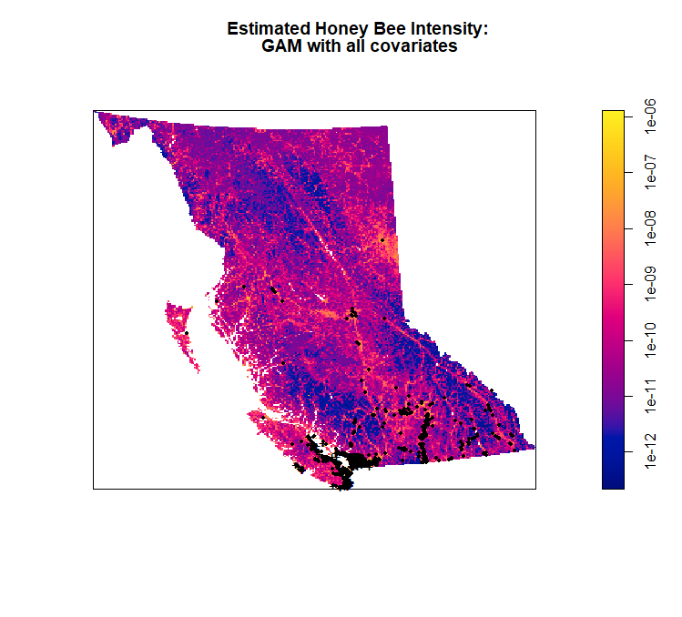

```{r global_options, include=FALSE, cache=FALSE}
## Set some options for knitr to apply globally
knitr::opts_chunk$set(cache=TRUE,
                      echo=FALSE,
                      autodep=TRUE,
                      message=FALSE,
                      warning=FALSE,
                      out.width="80%",
                      fig.asp=0.75,
                      fig.align='center',
                      fig.pos = "H", 
                      out.extra = "")
```

# Introduction - Noman

Provide a brief description of the study system from which the data come and an outline of what questions you intend on exploring with the data, citing any relevant literature. Length: ca. 1 page.

# Methods - All, see subsections

There should be enough information that anyone can reproduce the workflow if they had access to the data. Length: As long as necessary.

## Data collection and Description - Noman

Briefly describe the data and what variables are included.

## Exploratory Analysis - Vimal

Provide a detailed description of the analytical workflow that was applied to the data, citing any relevant literature and statistical packages employed.

## Model Development

The spatstats package, additionally has numerous functions that allow for easy predictive modeling on spatial data. For this study, before any models were built scaling of the elevation and distance to water (dist_water) covariates was required. This is because the scales for these variables have a wider range than the scales for the human footprint index, 0 to 10, and the forest coverage, 0 to 100 percent. Furthermore, as with all modeling building, it was also important to check for collinearity among the covariates. This was done using the package's cor.im function. Then numerous models, in the form of linear, quadratic, and generalize additive (gam), were built using the ppm function. Additionally, a b-spline function was used from the splines package for the gam models. Each of these models were evaluated by reviewing the partial residuals, AIC scores, likelihood ratio test, and diagnostics via the parres, AIC, anova, and diagnose ppm functions. Finally, all the models were tested on their ability to predict the intensity of honey bees in British Columbia using a fitted trend plot and the quadrat.test function.

# Results

## Exploratory Analysis - Vimal

Describe your statistical findings. Tables and figures should be used throughout. Length: As long as necessary.

## Model Selection
```{r echo=FALSE, warning=FALSE, message=FALSE, cache=TRUE}
library(spatstat)
library(maptools)
library(sp)
library(dplyr)

bdata <- read.csv('data/apis_data_clean.csv')
load('data/BC_Covariates.Rda') 

elev <- DATA$Elevation
forest <- DATA$Forest
hfi <- DATA$HFI
dist_water <- DATA$Dist_Water

#setup window and ppp
BC_win <- DATA$Window
BC_win <- as.owin(DATA$Window)

bees_ppp <- ppp(x = bdata$decimalLongitude, # X coordinates
                y = bdata$decimalLatitude, # Y coordinates
                window = BC_win)

#check for collinearity and save into a df for table printing later
cor_df <- as.data.frame(cor.im(elev,forest,hfi,dist_water, use="pairwise.complete.obs"))
colnames(cor_df) <- c('elev','forest','HFI','dist_water')
row.names(cor_df) <- c('elev','forest','HFI','dist_water')

#create and store a collinarity matrix plot
#pairs.im(elev,forest,hfi,dist_water)
#coll_plot = recordPlot()
#replayPlot(coll_plot)

#scale elevation and dist_water
mu <- mean(DATA$Elevation)
stdev <- sd(DATA$Elevation)
DATA$Elevation_scaled <- eval.im((Elevation - mu)/stdev, DATA)
mu <- mean(DATA$Dist_Water)
stdev <- sd(DATA$Dist_Water)
DATA$Dist_Water_scaled <- eval.im((Dist_Water - mu)/stdev, DATA)

elev_scale <- DATA$Elevation_scaled
dist_water_scale <- DATA$Dist_Water_scaled

##################################
#fit a linear and quadratic model
##################################

lin_mod <- ppm(bees_ppp ~ elev_scale + forest + hfi + dist_water_scale
                  , data = DATA)
quad_mod1 <- ppm(bees_ppp ~ elev_scale + I(elev_scale^2) + forest 
                 + I(forest^2) + hfi + I(hfi^2) + dist_water_scale 
                 + I(dist_water_scale^2), data = DATA)
```

As describe in the Model Development section, above, before developing any predictive models, it is important to review the collinearity among the covariates. Table \@ref(tab:corrsumm) and Figure \@ref(fig:corrmatrix), show that although there is some correlation between all covariates, the strongest is between elevation and HFI with a negative correlation of `r round(cor_df$elev[3],3)`. Since this value is less than the typical threshold of $\pm0.4$, the model building proceeded without taking these correlations into consideration.

```{r corrsumm, echo=FALSE, warning=FALSE, message=FALSE}
knitr::kable(cor_df, caption = "Covariate Correlation Matrix") %>% kableExtra::kable_styling(latex_options="hold_position")
```

```{r corrmatrix, echo=FALSE, warning=FALSE, message=FALSE, fig.cap="Covariate Correlation Matrix"}
knitr::include_graphics("images/coll_matrix.png")
```

```{r echo=FALSE, warning=FALSE, message=FALSE, cache=TRUE}
lin_AIC <- AIC(lin_mod)
quad1_AIC <- AIC(quad_mod1)
```
Based on the results describe in the Exploratory section, the first model taken into consideration was a full quadratic model. This was because of the evidence that the relationship between honey bee intensity and the covariates was at least not linear. Further proven by comparing the AIC values - `r round(lin_AIC,4)` for the linear model versus `r round(quad1_AIC,4)` for the full quadratic model - and running a likelihood ratio test that rejected the linear model in favour of this full quadratic model, seen in Figure \@ref(fig:quad1lrt). However, based on the predicted intensity plot in Figure \@ref(fig:quad1pred), it is clear that this model is not very good. There are many areas of the province that are predicted to have high intensity even though there are few bees located there, which are represented by the black dots. The poor model fit is further exemplified in the quadrat test for deviance as seen in Figure \@ref(fig:quad1quadtest). The tiny p-value of 0.001 means that the suitability of this model for predicting the intensity of honey bees should be rejected. Additionally the model summary, in Figure \@ref(fig:quad1summ), indicates that only the quadratic term of the dist_water covariate is significant. 
```{r quad1lrt, echo=FALSE, warning=FALSE, message=FALSE, fig.cap="Likelihood Ratio Test - Full Quadratic Model"}
knitr::include_graphics("images/LRT_quad1.png")
```

```{r quad1pred, echo=FALSE, warning=FALSE, message=FALSE, fig.cap="Predicted Honey Bee Intensity - Full Quadratic Model"}

```

```{r quad1quadtest, echo=FALSE, warning=FALSE, message=FALSE, fig.cap="Predicted Deviance - Full Quadratic Model"}
knitr::include_graphics("images/quadtest_quad1.png")
```

```{r quad1summ, echo=FALSE, warning=FALSE, message=FALSE, fig.cap="Full Quadratic Model Summary"}
knitr::include_graphics("images/summ_quad1.png")
```

```{r echo=FALSE, warning=FALSE, message=FALSE, cache=TRUE}
########################################
#new quadratic model without dist_water
#######################################
#fit model
quad_mod2 <- ppm(bees_ppp ~ elev_scale + I(elev_scale^2) + forest 
                 + I(forest^2) + hfi + I(hfi^2) + I(dist_water_scale^2), data = DATA)
#compute and compare AIC of quad1 and quad2 models
quad1_AIC <- AIC(quad_mod1)
quad2_AIC <- AIC(quad_mod2)
```
Therefore, the next model examined was another quadratic model but without the insignificant 'dist_water' term. While all the predictors were seen as significant in this model, as seen in Figure \@ref(fig:quad2summ), the predicted intensity plot did not change, Figure \@ref(fig:quad2pred). This model was also only a small improvement in AIC from the full quadratic model, `r quad2_AIC` from `r quad1_AIC`. However, the likelihood ratio test, as seen in Figure \@ref(fig:quad2lrt), does not support the reduced complexity since the p-value of $0.7636 > 0.05$. Meaning that the full quadratic model cannot be rejected in favour of the quadratic model without the 'dist_water term'. Furthermore, both models had nearly identical diagnostic plots, seen in Figure \@ref(fig:quad2diag), that indicate both models do not predicate the y coordinates adequately. That is for all parts of the province, the sum of residuals on the y coordinate fall outside the acceptable confidence band indicated by the dotted line. For the x coordinate, only the western and eastern edges of the province had acceptable residuals. No further diagnostics for either of these models were reviewed as a result.
```{r quad2summ, echo=FALSE, warning=FALSE, message=FALSE, fig.cap="Partial Quadratic Model Summary"}
knitr::include_graphics("images/summ_quad2.png")
```

```{r quad2pred, echo=FALSE, warning=FALSE, message=FALSE, fig.cap="Predicted Honey Bee Intensity - Partial Quadratic Model"}
knitr::include_graphics("images/pred_quad2.png")
```

```{r quad2lrt, echo=FALSE, warning=FALSE, message=FALSE, fig.cap="Likelihood Ratio Test - Partial Quadratic Model"}
knitr::include_graphics("images/LRT_quad2.png")
```

```{r quad2diag, echo=FALSE, warning=FALSE, message=FALSE, fig.cap="Diagnostics - Quadratic Models"}
knitr::include_graphics("images/diag_quad2.png")
```

```{r echo=FALSE, warning=FALSE, message=FALSE, cache=TRUE}
#############################
#gam model
############################
library(splines)
### fit ppp model
gam_smooth <- ppm(bees_ppp ~ bs(elev_scale,6) + bs(forest, 12) 
                  + bs(dist_water_scale,5) + bs(hfi, 6)
                  , data = DATA, use.gam = TRUE)
#compute and compare AIC of quad2 and gam_smooth models
quad2_AIC <- AIC(quad_mod2)
gam_smooth_AIC <- AIC(gam_smooth)
```
Thus, another type of model, such as a generalized additive model (GAM), seemed appropriate. The first GAM model trialed was a full model with 6 knots on the scaled elevation, 12 knots on the forest coverage, 5 knots on the scaled distance to water, and 6 knots on the HFI. As compared to the quadratic models, this more complex model was supported by the AIC comparison, `r gam_smooth_AIC` versus `r quad2_AIC`, and the likelihood ratio test, as seen in Figure \@ref(fig:gam1lrt). The tiny p-value means that the quadratic model can be rejected in favour of the current gam model. A review of the partial residuals plot in Figure \@ref(fig:gam1parres), shows that elevation, distance to water, forest coverage, and human footprint index are all well represented overall. However, as seen in a visualization of the predicted intensity, Figure \@ref(fig:gam1pred), there are still a lot of low populated areas that have been predicted to have high intensity. The test for deviation between predicted and observed gives evidence, with a p-value of 0.001, to reject the current game model, as seen in Figure \@ref(fig:gam1quadtest). The diagnostic plot, seen in Figure \@ref(fig:gam1diag), shows further evidence that while there was an improvement in the residuals when compared to the quadratic models, there was still room for improvement.
```{r gam1lrt, echo=FALSE, warning=FALSE, message=FALSE, fig.cap="Likelihood Ratio Test - GAM Model"}
knitr::include_graphics("images/LRT_gam1.png")
```

```{r gam1parres, echo=FALSE, warning=FALSE, message=FALSE, fig.cap="Partial Residuals - GAM Model"}

```

```{r gam1pred, echo=FALSE, warning=FALSE, message=FALSE, fig.cap="Predicted Honey Bee Intensity - GAM Model"}

```

```{r gam1quadtest, echo=FALSE, warning=FALSE, message=FALSE, fig.cap="Predicted Deviance - GAM Model"}
knitr::include_graphics("images/quadtest_gam1.png")
```

```{r gam1diag, echo=FALSE, warning=FALSE, message=FALSE, fig.cap="Diagnostics - GAM Model"}

```

```{r echo=FALSE, warning=FALSE, message=FALSE, cache=TRUE}
##################################
#gam model with x-y coordinates
#################################
library(splines)
gam_xy_smooth <- ppm(bees_ppp ~ bs(elev_scale,6) + bs(forest, 12) 
                  + bs(dist_water_scale,5) + bs(hfi, 6) + bs(x,6) + bs(y,7)
                  , data = DATA, use.gam = TRUE)

#compute and compare AIC of gam_smooth and gam_smooth_xy models
gam_smooth_AIC <- AIC(gam_smooth)
gam_xy_smooth_AIC <- AIC(gam_xy_smooth)
```
Since no other covariates were available for consideration, the last gam model was built with the same covariates as the previous model with the addition of the x and y coordinates as proxy covariates. These new predictors had 6 knots on the x coordinate and 7 knots on the y coordinate. When compared to the previous gam model, this new model did better with an AIC of `r gam_xy_smooth_AIC`, as compared to `r gam_smooth_AIC`, and is supported as per the small p-value of $< 2.2e^{-16}$ seen in the likelihood ratio results in Figure \@ref(fig:gam2lrt). The partial residuals plot, in Figure \@ref(fig:gam2parres), also indicate that all variables are better represented. Although this model should be rejected as per the quadrat test results seen in Figure \@ref(fig:gam2quadtest), the resulting p-value of 0.039 is the highest of the 4 models reviewed. Meaning that the deviation between the predicted and observed values was the lowest in this model. Visually, there are some further improvements in the predicted intensity plot, as seen in Figure \@ref(fig:gam2pred). However, there are still low observation areas that are predicted to have low intensity. This is likely due to the significant amount of residuals in the lower parts of the province as seen in the diagnostics plot in Figure \@ref(fig:gam2diag).

```{r gam2lrt, echo=FALSE, warning=FALSE, message=FALSE, fig.cap="Likelihood Ratio Test - GAM Model with X-Y"}
knitr::include_graphics("images/LRT_gam2.png")
```

```{r gam2parres, echo=FALSE, warning=FALSE, message=FALSE, fig.cap="Partial Residuals - GAM Model with X-Y"}
knitr::include_graphics("images/parres_gam2.png")
```

```{r gam2quadtest, echo=FALSE, warning=FALSE, message=FALSE, fig.cap="Predicted Deviance - GAM Model with X-Y"}
knitr::include_graphics("images/quadtest_gam2.png")
```

```{r gam2pred, echo=FALSE, warning=FALSE, message=FALSE, fig.cap="Predicted Honey Bee Intensity - GAM Model with X-Y"}
knitr::include_graphics("images/pred_gam2.png")
```

```{r gam2diag, echo=FALSE, warning=FALSE, message=FALSE, fig.cap="Diagnostics - GAM Model with X-Y"}
knitr::include_graphics("images/diag_gam2.png")
```

# Discussion - Vimal and Alyssa

Provide a brief summary of your findings. Length: ca. 1 page.

# References - All

Include references to all necessary literature.
