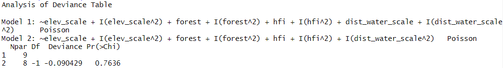

```{r global_options, include=FALSE, cache=FALSE}
## Set some options for knitr to apply globally
knitr::opts_chunk$set(cache=TRUE,
                      echo=FALSE,
                      autodep=TRUE,
                      message=FALSE,
                      warning=FALSE,
                      out.width="80%",
                      fig.asp=0.75,
                      fig.align='center',
                      fig.pos = "H", 
                      out.extra = "")
library(spatstat)
library(sp)
library(sf)
library(maptools)
library(rgdal)
library(rgbif)
library(spatstat.explore)
spatstat.messages=FALSE
sp.messages=FALSE
sf.messages=FALSE
maptools.messages=FALSE
rgbif.messages=FALSE
rgdal.messages=FALSE
options(spatstat=FALSE,crs.messages=FALSE)
```

# Introduction
Spatial statistics have increasingly become an essential tool in understanding species distribution and habitat preferences, as well as in informing conservation and management decisions. In this report, we will analyze the occurrence data of the western honey bee (Apis mellifera Linnaeus) in the province of British Columbia (BC), Canada. 

 

The western honey bee, a critical pollinator species, plays a vital role in agriculture and ecosystem services. Understanding the distribution patterns and potential drivers of honey bee occurrence can provide valuable insights for the conservation of this species and the ecosystems they support.

The honeybee is a vital pollinator that plays a significant role in both agricultural production and the maintenance of biodiversity in natural ecosystems. These insects contribute to the pollination of a wide range of crops, which directly affects human food supply, as well as sustaining the health and productivity of various plant species within their habitats (Klein et al., 2007).

British Columbia (BC), a province within Canada, encompasses diverse ecosystems that support a rich array of plant and animal species. Honeybees are vital contributors to the pollination processes within these ecosystems and are essential for the productivity of the region's agricultural sector. Understanding the spatial distribution of honeybee populations in British Columbia is crucial for developing effective conservation and management strategies to protect these invaluable pollinators.

In this study, we aim to explore the spatial distribution of honeybee populations (Apis mellifera) in British Columbia using occurrence data obtained from the Global Biodiversity Information Facility (GBIF) database. Our analysis will focus on describing the spatial distribution of Apis mellifera in the region, identifying any clustering or dispersion patterns in the occurrence data, and assessing the relationships between honeybee occurrence and various covariates, such as elevation, forest cover, Human Footprint Index (HFI), and distance to water sources. To achieve our objectives, we will construct a Poisson process model to analyze the spatial distribution of Apis mellifera occurrences in British Columbia. We will explore various statistical techniques, including creating rho plots, and examining the first and second moment statistics to gain insights into the clustering or dispersion patterns in the data. Furthermore, we will evaluate the relationship between honeybee occurrence and covariates such as elevation, forest cover, HFI, and distance to water sources, using spatial regression analysis. This will enable us to identify significant predictors that influence the spatial distribution of honeybee populations in the region. Additionally, we will explore collinearity between covariates, and use model validation techniques such as chi-squared tests and AIC scores. Overall, our approach will involve a combination of statistical modeling and exploratory data analysis techniques to gain a deeper understanding of the factors that influence honeybee occurrence in British Columbia.

# Methods - All, see subsections

There should be enough information that anyone can reproduce the workflow if they had access to the data. Length: As long as necessary.

## Data collection and Description
This dataset contains occurrence records of the honey bee species Apis mellifera Linnaeus in the province of British Columbia, Canada. The data was collected using the 'rgbif' package in R, which allows for the retrieval of biodiversity data from the Global Biodiversity Information Facility (GBIF) database. It is important to note that the dataset may be subject to potential biases due to the reliance on self-reporting by the individuals or institutions responsible for collecting the data. This means that the accuracy and completeness of the information provided may vary depending on the quality of the reporting.

The first step involved querying the number of records available for Apis mellifera Linnaeus in British Columbia. The complete dataset was then downloaded by specifying the scientific name, coordinates, country, and stateProvince parameters. After obtaining the data, it was saved as a CSV file.

The dataset contains various variables, including decimalLongitude, decimalLatitude, country, stateProvince, occurrenceStatus, coordinateUncertaintyInMeters, taxonID, catalogNumber, institutionCode, eventTime, verbatimEventDate, collectionCode, gbifID, verbatimLocality, class, isInCluster, year, month, day, eventDate, modified, and lastInterpreted. These variables provide information on the location of each occurrence, the institution responsible for collecting the data, and other details about the occurrence event.

To clean the dataset, records indicating absence or zero-abundance were removed. Furthermore, the dataset's coordinates were adjusted to match the covariate data's format. A SpatialPointsDataFrame object was created using the cleaned dataset, and the WGS84 CRS (EPSG:4326) was assigned to it. The coordinates were then transformed to match the CRS of the BC_win object, which has the Albers Equal Area Conic projection, and the transformed coordinates were added to the original cleaned dataframe.

Finally, the cleaned and transformed data was saved as a new CSV file.

In addition to the occurrence data, covariate data for the province of British Columbia is available. The covariate dataset includes variables such as Elevation, Forest, HFI (Human Footprint Index), and Dist_water (Distance to water). These variables provide information about the environmental conditions of each occurrence site, which can be useful for understanding the factors influencing the distribution and abundance of Apis mellifera Linnaeus in the province.

## Exploratory Analysis - Vimal

The spatstats package has multiple functions to help us do exploratory data analysis. We will start with finding the number of points using the function npoints(). We then find the intensity both homogeneous and inhomogeneous using the functions intensity() and quadratcount() respectively. We then do a test of homogeneity to check if the intensity is homogeneous or not using quadrat.test(). After determining that the intensity is homogeneous, we estimate it using kernel density estimation as well with the function density(). We then move on to find the areas of high intensity with hotspot analysis where we do a scan test and plot the pvalues to see where the areas of high intensity are. Next we check the relation of intensity with covariate using rhohat() function and check for any evidence of clustering using the inhomogeneous K-function and confirm the findings of K-function using pair correlation function pcf_inhom(). We use the plot from rhohat() which shows the relation between intensity and covariates to specify the initial model and perform model selection and validation. 

## Model Development

The spatstats package, additionally has numerous functions that allow for easy predictive modeling on spatial data. For this study, before any models were built scaling of the elevation and distance to water (dist_water) covariates was required. This is because the scales for these variables have a wider range than the scales for the human footprint index, 0 to 10, and the forest coverage, 0 to 100 percent. Furthermore, as with all modeling building, it was also important to check for collinearity among the covariates. This was done using the package's cor.im function. Then numerous models, in the form of linear, quadratic, and generalize additive (gam), were built using the ppm function. Additionally, a b-spline function was used from the splines package for the gam models. Each of these models were evaluated by reviewing the partial residuals, AIC scores, likelihood ratio test, and diagnostics via the parres, AIC, anova, and diagnose ppm functions. Finally, all the models were tested on their ability to predict the intensity of honey bees in British Columbia using a fitted trend plot and the quadrat.test function.

# Results

## Exploratory Analysis - Vimal

### Number of data points 

```{r}
# number of points

npoints(apis_data_ppp)
```

### Intensity

Assuming intensity is homogeneous, we use the in-built function to find the value of intensity.

```{r cache=T}
# intensity

intensity(apis_data_ppp)
```


### Quadrat counting

In most real scenarios, $\lambda$ is likely to be spatially varying. When $\lambda$ is spatially varying, the intensity at any location u is $\lambda(u)$ and it can be estimated non-parametrically by dividing the window into sub-regions called quadrats. Let us do quadrat counting to find the inhomogeneous intensity:


```{r cache=T}
# quadrat counting (4x2 quadrat)

myquadrat = quadratcount(apis_data_ppp, nx = 2, ny = 3)
plot(apis_data_ppp, pch = 16, use.marks=F, cols = "#046C9A", main = "Intensity of Bees in BC")
plot(myquadrat, cex=2, col="red", add=T)

# plot intensity in each quadrat
plot(intensity(myquadrat, image=T), main = "Inhomogeneous Intensity")
```

Clearly, the assumption of homogeneity is inappropriate for this dataset as the bees tend to be clustered in certain areas of the study site, whereas others have no bees at all. Quadrat counting suggests a spatially varying, inhomogeneous $\lambda(u)$ , but point processes are stochastic and some variation is expected by chance alone. Our eyes are also a poor judge of homogeneity, so we should ideally test for spatial homogeneity objectively. Under a null hypothesis that the intensity is homogeneous, we carry out the test for significant deviations from complete spatial randomness which is the quadrat test.

### Test of homogeneity

```{r cache=T}
# test of homogeneity

quadrat.test(myquadrat)
```

The small p-value (< 2.2e-16) indicates that the observed pattern of points is significantly non-random with very strong evidence against the null hypothesis of complete spatial randomness (CSR) at any significance level. Hence, there is a significant deviation from homogeneity. The p-value doesn’t provide any information on the cause of inhomogeneity, however,  significant deviations can be due to the processes truly being inhomogeneous, but also due to a lack of independence between points. 

### Kernel Estimation

A spatially varying, $\lambda(u)$ can also be estimated non-parametrically by kernel estimation. Kernels estimate $\lambda(u)$ by placing kernels' on each data point (often bi-variate Gaussian) and optimizing the bandwidth’ (i.e., the standard deviation of the kernel).

```{r cache=T}
# kernel estimation

lambda_u_hat = density(apis_data_ppp)
plot(lambda_u_hat, main="Kernel Estimation of Intensity")
plot(apis_data_ppp, pch=16, cex=0.6, add=T, use.marks=F, cols="white")
plot(apis_data_ppp, pch=16, cex=0.4, add=T, use.marks=F, cols="black")
```

```{r}
# using different bandwidth optimiser

plot(density(apis_data_ppp, sigma = bw.ppl),  # Likelihood Cross Validation Bandwidth Selection
     ribbon = T,
     main = "")
plot(apis_data_ppp, pch=16, cex=0.6, add=T, use.marks=F, cols="white")
plot(apis_data_ppp, pch=16, cex=0.4, add=T, use.marks=F, cols="black")
```

Using the plots above, we can see that southern region of BC has high intensity and there is mostly no change in the northern and central BC area. This is consistent with the findings of the quadrat count graph as well.

### Hotspot analysis

Even though we can see from the plot above that the intensity is inhomogeneous and higher in the south, we would still like to identify areas where the intensity is elevated. This is what we will do below using 'scan test'.

As the intensity is inhomogeneous, at each location u, we can draw a circle of radius 'r' (we call this my_R in the code below) and then count the number of points in and out of the circle. This 'r' has been found through kernel bandwidth optimization. Also, under an assumption that the process is Poisson distributed, we can calculate a likelihood ratio test statistic for the number of points inside vs. outside the circle. The null distribution is $\chi^2$ with 1 degree of freedom allowing us to calculate p-values at each location u.

```{r cache=T}
# hotspot analysis via scan test

# estimate R
my_R = bw.ppl(apis_data_ppp)

# calculate test statistic
my_lr = scanLRTS(apis_data_ppp, r= my_R)

# plot the output
# plot(my_lr, main="Likelihood Ratio")
# plot(BC_win, add=T)

# compute pvalues
pvals = eval.im(pchisq(my_lr, df=1, lower.tail=F))

# plot output
plot(pvals, main = "Local p-values")
plot(BC_win, add=T)
```

From the p-value plot, we can see that the hot spot areas are more densely situated towards the south of BC.

### Check relation with covariate (Elevation)

```{r cache=T, warning=F}
# estimate rho
rho_e = rhohat(apis_data_ppp, DATA$Elevation)
rho_f = rhohat(apis_data_ppp, DATA$Forest)
rho_h = rhohat(apis_data_ppp, DATA$HFI)
rho_d = rhohat(apis_data_ppp, DATA$Dist_Water)
```

```{r}
# plot rhos for different covariates side-by-side
par(mfrow=c(2,2))
plot(rho_e, main="Rho vs Elevation")
plot(rho_f, main="Rho vs Forest")
plot(rho_h, main="Rho vs HFI")
plot(rho_d, main="Rho vs Distance from Water")
```

The intensity seems to have a non-linear relation with elevation, forest, human footprint index and distance from water. We can use these relations to be a good starting point to specify an initial model and start selecting and validating more models based on this initial model and how it performs. 

### Using Ripley's $K$-function to test for a significant ($\alpha$ = 0.05) correlation between locations

As the intensity is inhomogeneous, we will be using 'Kinhom' function to plot the K-function.

```{r cache=T}
#Estimate a strictly positive density
lambda <- density(apis_data_ppp, sigma=bw.ppl, positive=TRUE)

inhom <- envelope(apis_data_ppp,
                  Kinhom,
                  simulate = expression(rpoispp(lambda)),
                  correction="border",
                  rank = 1,
                  nsim = 19, # for alpha = 0.05
                  fix.n = TRUE)

# visualise the results
plot(inhom, main = "", lwd = 2, xlim=c(0, 300000))
```

The shading is centered around the estimated K-function and the width of the shaded region reflects the precision of the estimate. The confidence band is around the observed values mostly for the entirety of the plot and the expected values denoted by the red line are inside the band too. Hence, there is no significant evidence of clustering among bees.

### Estimating homogeneous and inhomogeneous pair correlation functions, using simulation envelopes. 

```{r}
## Simulation envelope (with points drawn from the estimated intensity)

# homogeneous
pcf_hom <- envelope(apis_data_ppp,
                    pcf,
                    simulate = expression(rpoispp(lambda)),
                    rank = 1,
                    nsim = 19)

# inhomogeneous
pcf_inhom <- envelope(apis_data_ppp,
                      pcfinhom,
                      simulate = expression(rpoispp(lambda)),
                      rank = 1,
                      nsim = 19)

# visualise the results
plot(pcf_hom, main="Homogeneous PCF", lwd=2)
plot(pcf_inhom, main="Inhomogeneous PCF", lwd=2)
```

g(r) is the probability of observing a pair of points of the process separated by a distance r, divided by the corresponding probability for a Poisson process. Pair correlations function contains contributions only from inter-point distances equal to r (and not <= r). We will use the inhomogeneous pair correlation function as our point process is inhomogeneous. As g(r)> 1 indicates that this inter-point distance is more frequent than expected for a completely random pattern, we can say that there is significant evidence of clustering at very low values of r for our point process.

## Model Selection
```{r echo=FALSE, warning=FALSE, message=FALSE, cache=TRUE}
library(spatstat)
library(maptools)
library(sp)
library(dplyr)

bdata <- read.csv('data/apis_data_clean.csv')
load('data/BC_Covariates.Rda') 

elev <- DATA$Elevation
forest <- DATA$Forest
hfi <- DATA$HFI
dist_water <- DATA$Dist_Water

#setup window and ppp
BC_win <- DATA$Window
BC_win <- as.owin(DATA$Window)

bees_ppp <- ppp(x = bdata$decimalLongitude, # X coordinates
                y = bdata$decimalLatitude, # Y coordinates
                window = BC_win)

#check for collinearity and save into a df for table printing later
cor_df <- as.data.frame(cor.im(elev,forest,hfi,dist_water, use="pairwise.complete.obs"))
colnames(cor_df) <- c('elev','forest','HFI','dist_water')
row.names(cor_df) <- c('elev','forest','HFI','dist_water')

#create and store a collinarity matrix plot
#pairs.im(elev,forest,hfi,dist_water)
#coll_plot = recordPlot()
#replayPlot(coll_plot)

#scale elevation and dist_water
mu <- mean(DATA$Elevation)
stdev <- sd(DATA$Elevation)
DATA$Elevation_scaled <- eval.im((Elevation - mu)/stdev, DATA)
mu <- mean(DATA$Dist_Water)
stdev <- sd(DATA$Dist_Water)
DATA$Dist_Water_scaled <- eval.im((Dist_Water - mu)/stdev, DATA)

elev_scale <- DATA$Elevation_scaled
dist_water_scale <- DATA$Dist_Water_scaled

##################################
#fit a linear and quadratic model
##################################

lin_mod <- ppm(bees_ppp ~ elev_scale + forest + hfi + dist_water_scale
                  , data = DATA)
quad_mod1 <- ppm(bees_ppp ~ elev_scale + I(elev_scale^2) + forest 
                 + I(forest^2) + hfi + I(hfi^2) + dist_water_scale 
                 + I(dist_water_scale^2), data = DATA)
```

As describe in the Model Development section, above, before developing any predictive models, it is important to review the collinearity among the covariates. Table \@ref(tab:corrsumm) and Figure \@ref(fig:corrmatrix), show that although there is some correlation between all covariates, the strongest is between elevation and HFI with a negative correlation of `r round(cor_df$elev[3],3)`. Since this value is less than the typical threshold of $\pm0.4$, the model building proceeded without taking these correlations into consideration.

```{r corrsumm, echo=FALSE, warning=FALSE, message=FALSE}
knitr::kable(cor_df, caption = "Covariate Correlation Matrix") %>% kableExtra::kable_styling(latex_options="hold_position")
```

```{r corrmatrix, echo=FALSE, warning=FALSE, message=FALSE, fig.cap="Covariate Correlation Matrix"}

```

```{r echo=FALSE, warning=FALSE, message=FALSE, cache=TRUE}
lin_AIC <- AIC(lin_mod)
quad1_AIC <- AIC(quad_mod1)
```
Based on the results describe in the Exploratory section, the first model taken into consideration was a full quadratic model. This was because of the evidence that the relationship between honey bee intensity and the covariates was at least not linear. Further proven by comparing the AIC values - `r round(lin_AIC,4)` for the linear model versus `r round(quad1_AIC,4)` for the full quadratic model - and running a likelihood ratio test that rejected the linear model in favour of this full quadratic model, seen in Figure \@ref(fig:quad1lrt). However, based on the predicted intensity plot in Figure \@ref(fig:quad1pred), it is clear that this model is not very good. There are many areas of the province that are predicted to have high intensity even though there are few bees located there, which are represented by the black dots. The poor model fit is further exemplified in the quadrat test for deviance as seen in Figure \@ref(fig:quad1quadtest). The tiny p-value of 0.001 means that the suitability of this model for predicting the intensity of honey bees should be rejected. Additionally the model summary, in Figure \@ref(fig:quad1summ), indicates that only the quadratic term of the dist_water covariate is significant. 
```{r quad1lrt, echo=FALSE, warning=FALSE, message=FALSE, fig.cap="Likelihood Ratio Test - Full Quadratic Model"}

```

```{r quad1pred, echo=FALSE, warning=FALSE, message=FALSE, fig.cap="Predicted Honey Bee Intensity - Full Quadratic Model"}
knitr::include_graphics("images/pred_quad1.png")
```

```{r quad1quadtest, echo=FALSE, warning=FALSE, message=FALSE, fig.cap="Predicted Deviance - Full Quadratic Model"}

```

```{r quad1summ, echo=FALSE, warning=FALSE, message=FALSE, fig.cap="Full Quadratic Model Summary"}

```

```{r echo=FALSE, warning=FALSE, message=FALSE, cache=TRUE}
########################################
#new quadratic model without dist_water
#######################################
#fit model
quad_mod2 <- ppm(bees_ppp ~ elev_scale + I(elev_scale^2) + forest 
                 + I(forest^2) + hfi + I(hfi^2) + I(dist_water_scale^2), data = DATA)
#compute and compare AIC of quad1 and quad2 models
quad1_AIC <- AIC(quad_mod1)
quad2_AIC <- AIC(quad_mod2)
```
Therefore, the next model examined was another quadratic model but without the insignificant 'dist_water' term. While all the predictors were seen as significant in this model, as seen in Figure \@ref(fig:quad2summ), the predicted intensity plot did not change, Figure \@ref(fig:quad2pred). This model was also only a small improvement in AIC from the full quadratic model, `r quad2_AIC` from `r quad1_AIC`. However, the likelihood ratio test, as seen in Figure \@ref(fig:quad2lrt), does not support the reduced complexity since the p-value of $0.7636 > 0.05$. Meaning that the full quadratic model cannot be rejected in favour of the quadratic model without the 'dist_water term'. Furthermore, both models had nearly identical diagnostic plots, seen in Figure \@ref(fig:quad2diag), that indicate both models do not predicate the y coordinates adequately. That is for all parts of the province, the sum of residuals on the y coordinate fall outside the acceptable confidence band indicated by the dotted line. For the x coordinate, only the western and eastern edges of the province had acceptable residuals. No further diagnostics for either of these models were reviewed as a result.
```{r quad2summ, echo=FALSE, warning=FALSE, message=FALSE, fig.cap="Partial Quadratic Model Summary"}

```

```{r quad2pred, echo=FALSE, warning=FALSE, message=FALSE, fig.cap="Predicted Honey Bee Intensity - Partial Quadratic Model"}

```

```{r quad2lrt, echo=FALSE, warning=FALSE, message=FALSE, fig.cap="Likelihood Ratio Test - Partial Quadratic Model"}

```

```{r quad2diag, echo=FALSE, warning=FALSE, message=FALSE, fig.cap="Diagnostics - Quadratic Models"}

```

```{r echo=FALSE, warning=FALSE, message=FALSE, cache=TRUE}
#############################
#gam model
############################
library(splines)
### fit ppp model
gam_smooth <- ppm(bees_ppp ~ bs(elev_scale,6) + bs(forest, 12) 
                  + bs(dist_water_scale,5) + bs(hfi, 6)
                  , data = DATA, use.gam = TRUE)
#compute and compare AIC of quad2 and gam_smooth models
quad2_AIC <- AIC(quad_mod2)
gam_smooth_AIC <- AIC(gam_smooth)
```
Thus, another type of model, such as a generalized additive model (GAM), seemed appropriate. The first GAM model trialed was a full model with 6 knots on the scaled elevation, 12 knots on the forest coverage, 5 knots on the scaled distance to water, and 6 knots on the HFI. As compared to the quadratic models, this more complex model was supported by the AIC comparison, `r gam_smooth_AIC` versus `r quad2_AIC`, and the likelihood ratio test, as seen in Figure \@ref(fig:gam1lrt). The tiny p-value means that the quadratic model can be rejected in favour of the current gam model. A review of the partial residuals plot in Figure \@ref(fig:gam1parres), shows that elevation, distance to water, forest coverage, and human footprint index are all well represented overall. However, as seen in a visualization of the predicted intensity, Figure \@ref(fig:gam1pred), there are still a lot of low populated areas that have been predicted to have high intensity. The test for deviation between predicted and observed gives evidence, with a p-value of 0.001, to reject the current game model, as seen in Figure \@ref(fig:gam1quadtest). The diagnostic plot, seen in Figure \@ref(fig:gam1diag), shows further evidence that while there was an improvement in the residuals when compared to the quadratic models, there was still room for improvement.
```{r gam1lrt, echo=FALSE, warning=FALSE, message=FALSE, fig.cap="Likelihood Ratio Test - GAM Model"}
knitr::include_graphics("images/LRT_gam1.png")
```

```{r gam1parres, echo=FALSE, warning=FALSE, message=FALSE, fig.cap="Partial Residuals - GAM Model"}
knitr::include_graphics("images/parres_gam1.png")
```

```{r gam1pred, echo=FALSE, warning=FALSE, message=FALSE, fig.cap="Predicted Honey Bee Intensity - GAM Model"}
knitr::include_graphics("images/pred_gam1.png")
```

```{r gam1quadtest, echo=FALSE, warning=FALSE, message=FALSE, fig.cap="Predicted Deviance - GAM Model"}

```

```{r gam1diag, echo=FALSE, warning=FALSE, message=FALSE, fig.cap="Diagnostics - GAM Model"}
knitr::include_graphics("images/diag_gam1.png")
```

```{r echo=FALSE, warning=FALSE, message=FALSE, cache=TRUE}
##################################
#gam model with x-y coordinates
#################################
library(splines)
gam_xy_smooth <- ppm(bees_ppp ~ bs(elev_scale,6) + bs(forest, 12) 
                  + bs(dist_water_scale,5) + bs(hfi, 6) + bs(x,6) + bs(y,7)
                  , data = DATA, use.gam = TRUE)

#compute and compare AIC of gam_smooth and gam_smooth_xy models
gam_smooth_AIC <- AIC(gam_smooth)
gam_xy_smooth_AIC <- AIC(gam_xy_smooth)
```
Since no other covariates were available for consideration, the last gam model was built with the same covariates as the previous model with the addition of the x and y coordinates as proxy covariates. These new predictors had 6 knots on the x coordinate and 7 knots on the y coordinate. When compared to the previous gam model, this new model did better with an AIC of `r gam_xy_smooth_AIC`, as compared to `r gam_smooth_AIC`, and is supported as per the small p-value of $< 2.2e^{-16}$ seen in the likelihood ratio results in Figure \@ref(fig:gam2lrt). The partial residuals plot, in Figure \@ref(fig:gam2parres), also indicate that all variables are better represented. Although this model should be rejected as per the quadrat test results seen in Figure \@ref(fig:gam2quadtest), the resulting p-value of 0.039 is the highest of the 4 models reviewed. Meaning that the deviation between the predicted and observed values was the lowest in this model. Visually, there are some further improvements in the predicted intensity plot, as seen in Figure \@ref(fig:gam2pred). However, there are still low observation areas that are predicted to have low intensity. This is likely due to the significant amount of residuals in the lower parts of the province as seen in the diagnostics plot in Figure \@ref(fig:gam2diag).

```{r gam2lrt, echo=FALSE, warning=FALSE, message=FALSE, fig.cap="Likelihood Ratio Test - GAM Model with X-Y"}
knitr::include_graphics("images/LRT_gam2.png")
```

```{r gam2parres, echo=FALSE, warning=FALSE, message=FALSE, fig.cap="Partial Residuals - GAM Model with X-Y"}

```

```{r gam2quadtest, echo=FALSE, warning=FALSE, message=FALSE, fig.cap="Predicted Deviance - GAM Model with X-Y"}

```

```{r gam2pred, echo=FALSE, warning=FALSE, message=FALSE, fig.cap="Predicted Honey Bee Intensity - GAM Model with X-Y"}

```

```{r gam2diag, echo=FALSE, warning=FALSE, message=FALSE, fig.cap="Diagnostics - GAM Model with X-Y"}

```

# Discussion - Vimal and Alyssa

The number of data points in the dataset is 2614. Test of homogeneity was done to see if the intensity is homogeneous and the intensity was found to be inhomogeneous which was also checked using quadrat count and validated using kernel estimation. On plotting the Kernel estimation of intensity and overlaying the points on it, it was seen that the points are aggregated more towards the south region of BC which was also confirmed by the hotspot analysis. Next, we proceeded to check the relation of intensity with the different covariates and the were all observed to be non linearly related with intensity. This gave us a good starting point for initial model specification. Inhomogeneous K-function (Kinhom) was used to see if there is evidence of clustering. It was found that only at very low values of r (<10000 units) there was evidence of clustering. This finding was  confirmed by the inhomogeneous pair correlation function envelopes done with 19 iterations which equals a significance level of 0.05.

# References - All

Klein, A. M., Vaissiere, B. E., Cane, J. H., Steffan-Dewenter, I., Cunningham, S. A., Kremen, C., & Tscharntke, T. (2007). Importance of pollinators in changing landscapes for world crops. Proceedings of the Royal Society B: Biological Sciences, 274(1608), 303–313. https://doi.org/10.1098/rspb.2006.3721
